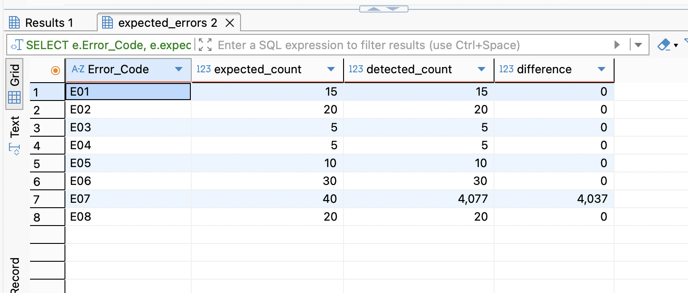

# NZ-Tertiary-Education-Compliance-and-Retention-Analysis

A portfolio project combining SQL-based SDR validation and Power BI dashboarding to identify retention risk and student experience gaps in a New Zealand tertiary education setting.

## Business Case

This project simulates a realistic scenario for a New Zealand tertiary education provider that needs to:

1. validate SDR-related learner and enrolment data before reporting, and
2. analyse student experience survey data to identify retention risk patterns across faculties and student groups.

The goal was to combine compliance-focused SQL checks with business-facing dashboard insights for non-technical stakeholders.

## Tools Used

- Python
- MySQL
- Power BI
- CSV flat files

## Dataset Overview

This project uses four synthetic datasets:

- `SDR_LEAR.csv` — learner-level demographic and profile data
- `SDR_ENRL.csv` — enrolment-level records for courses, dates, EFTS, and funding information
- `STUDENT_SURVEY.csv` — student experience survey responses, including teaching, support, belonging, administrative experience, and retention likelihood
- `EXPECTED_ERRORS.csv` — ground-truth injected error log used to validate SQL detection logic

## SQL Validation Layer

I built a set of SQL validation checks to test common SDR-style data quality issues, including:

- invalid NSN format
- missing ethnicity
- future DOB
- learners under 16
- missing gender
- end date before start date
- overlapping enrolment logic
- EFTS above expected threshold
- international students with domestic-only funding code
- exact duplicate enrolment rows
- missing faculty

Most validation checks matched the injected error log exactly. The overlap rule initially over-detected exceptions, so I treated it as a refinement item rather than forcing an inaccurate final rule.

### Validation Comparison



### Example SQL

```sql
SELECT
    e.Error_Code,
    e.expected_count,
    d.detected_count,
    d.detected_count - e.expected_count AS difference
FROM (
    SELECT Error_Code, COUNT(*) AS expected_count
    FROM expected_errors
    WHERE Error_Code IN ('E01','E02','E03','E04','E05','E06','E07','E08')
    GROUP BY Error_Code
) e
LEFT JOIN (
    SELECT 'E01' AS Error_Code, 15 AS detected_count
    UNION ALL SELECT 'E02', 20
    UNION ALL SELECT 'E03', 5
    UNION ALL SELECT 'E04', 5
    UNION ALL SELECT 'E05', 10
    UNION ALL SELECT 'E06', 30
    UNION ALL SELECT 'E07', 4077
    UNION ALL SELECT 'E08', 20
) d
ON e.Error_Code = d.Error_Code
ORDER BY e.Error_Code;
```

## Business Analysis SQL

To move from compliance checking to stakeholder-facing insight generation, I also used SQL to summarise retention risk across faculties and student groups.

## aculty-Level Retention Risk

The query below calculates the proportion of low-retention responses by faculty. This helped identify Foundation Studies as the clearest faculty-level risk group.

SELECT
    Faculty,
    COUNT(*) AS total_responses,
    SUM(CASE WHEN Retention_Likelihood <= 5 THEN 1 ELSE 0 END) AS low_retention_count,
    ROUND(
        SUM(CASE WHEN Retention_Likelihood <= 5 THEN 1 ELSE 0 END) * 100.0 / COUNT(*),
        2
    ) AS low_retention_pct
FROM student_survey
GROUP BY Faculty
ORDER BY low_retention_pct DESC;

## Citizenship-Based Retention Risk

I also compared retention risk by citizenship group and found that international students had the highest low-retention percentage.

## Power BI Dashboard

The Power BI report was designed as a three-page dashboard focused on retention risk and student experience gaps.

### Page 1 — Retention Risk Overview

This page ranks low-retention percentage across key groups:

- faculty

- ethnicity

- citizenship status

It highlights that:

Foundation Studies had the highest faculty-level retention risk

Māori and Pacific Peoples showed higher low-retention percentages by ethnicity

International students had the highest low-retention rate by citizenship group

### Page 2 — Faculty Deep Dive

This page compares:

- average teaching score

- average support score

- average belonging score

- average retention likelihood

- low-retention percentage

at the faculty level.

It shows that Foundation Studies stood out as the clearest faculty-level risk group.

### Page 3 — Equity & Student Experience

This page focuses on ethnicity and citizenship-based experience gaps.

It combines:

- low-retention % by ethnicity

- low-retention % by citizenship status

- scorecard-style comparison of support, belonging, and retention

This helps explain not just who is at higher risk, but also which student experience indicators may be linked to that risk.

## Key Insights

Foundation Studies had the highest low-retention percentage at 38.1%.

Māori and Pacific Peoples showed higher retention risk than NZ European students.

International students had the highest low-retention percentage among citizenship groups.

Higher-risk groups also tended to show weaker support and belonging scores.

SQL validation results aligned closely with the injected error log, strengthening confidence in the compliance layer.

## What I Learned

This project helped me strengthen my ability to:

design SQL validation checks against a known error log

combine compliance-focused data work with business-facing insight generation

use Power BI to translate grouped retention patterns into clear dashboard stories

communicate analytical findings in plain English for non-technical stakeholders

## Repository Structure

/data
  SDR_LEAR.csv
  SDR_ENRL.csv
  STUDENT_SURVEY.csv
  EXPECTED_ERRORS.csv

/sql
  validation_checks.sql
  business_analysis.sql

/screenshots
  validation_expected_vs_detected.png
  retention_by_faculty_low_retention_pct_sql.png
  retention_by_citizenship_low_retention_pct_sql.png
  powerbi_retention_risk_overview.png
  powerbi_faculty_deep_dive.png
  powerbi_equity_student_experience.png

/docs
  SQL_Validation_Interview_Notes_v3.docx

